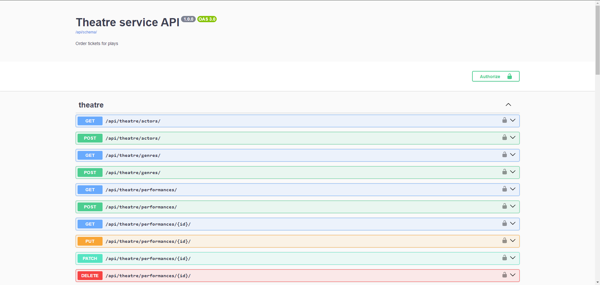
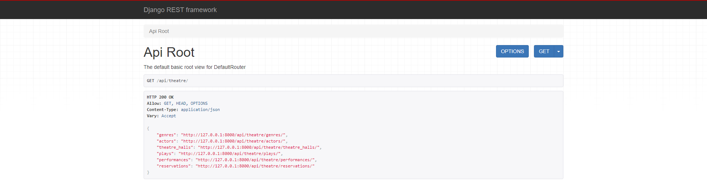
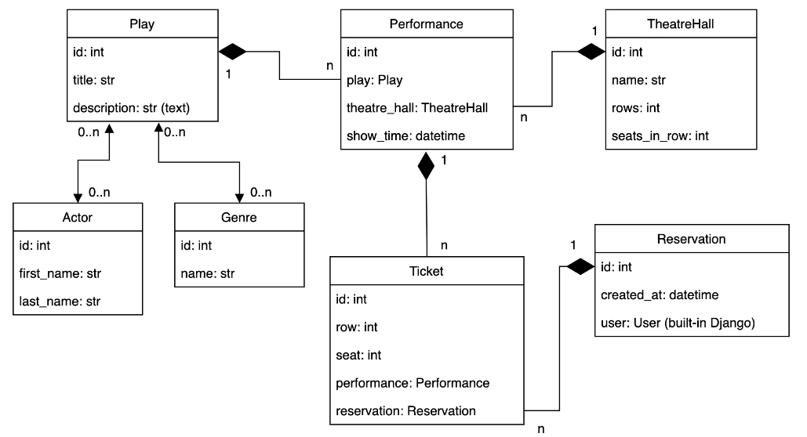

# Theatre Service API
### API service for theatre management written on DRF

## Installing using GitHub
Install PostgreSQL and create db.

Open Terminal to run following commands:
1) Clone the repository:
    ```
    git clone https://github.com/your-username/theatre-service.git
    ```
2) Create and activate virtual environment:
   * **On Windows**
      ```
      python -m venv venv
      ```
   
      ```
      venv\Scripts\activate
      ```
   
   *   **On MacOS**
      ```
      python3 -m venv venv
      ```
   
      ```
      source venv/bin/activate
      ```
3) Install needed requirements:
    ```
    pip install -r requirements.txt
    ```

4) Run database migrations:
    ```
    python manage.py migrate
    ```

5) Install database fixture:

   ```
   python manage.py loaddata db_data.json
   ```

6) Create .env file using ```env.sample``` file

7) Run server:
   
   ```
   python manage.py runserver
   ```

8) Go to [http://127.0.0.1:8000/](http://127.0.0.1:8000/)
## Run with Docker
Docker should be installed.

- pull docker container
    ``` 
    docker pull yevheniirabenko/theatre_service_api
    ```
- run container
    ```
    docker-compose build
    docker-compose up
    ```

## Getting access
* create user via /api/user/register/
* get access token via /api/user/token/
* look for documentation via /api/doc/swagger/
* admin panel via /admin/
### Create admin:
   ```
   python manage.py createsuperuser
   ```

## Features
* JWT Authentication
* Email-Based Authentication
* Admin panel
* Throttling Mechanism
* API documentation
* Creating Play with Image
* Filtering for Plays
* Managing orders and tickets
* Implement a new permission class 

## Demo
* Documentation:


* Api Root:


* DB Structure:


